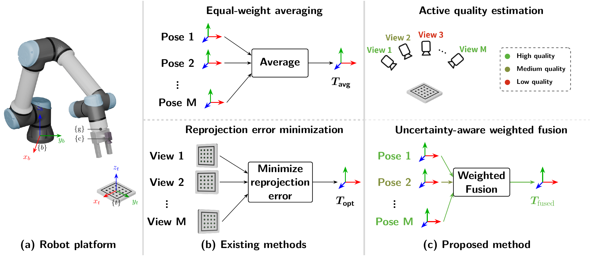
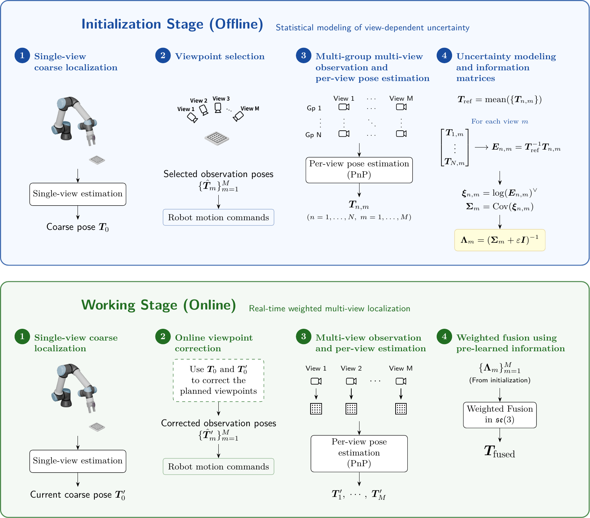

# Uncertainty-Aware Active Multi-View Pose Estimation for Robotic Arms

**Wendi Gan, Wei Zhai<sup>*</sup>, Yang Cao, and Zheng-Jun Zha**

**Accepted at PRCV 2026**

[[Paper](multi-view-pose-estimation-paper.pdf)]



*Figure 1. Overview of the robot platform, existing multi-view pose estimation methods, and the proposed uncertainty-aware weighted fusion method.*

## Method Overview

Pose estimates obtained from different viewpoints exhibit distinct error distributions because of viewpoint-dependent visual noise and robot kinematic errors. The proposed method learns these differences during a one-time offline initialization stage. Repeated pose observations are mapped to the Lie algebra $\mathfrak{se}(3)$, where a covariance matrix and its corresponding information matrix are estimated for each viewpoint.

During online operation, the planned viewpoints are corrected using the current coarse pose. The poses independently estimated from these viewpoints are then fused using the pre-learned information matrices, reducing the influence of unreliable viewing geometries while retaining real-time inference.



*Figure 2. The offline stage estimates viewpoint-specific information matrices, and the online stage reuses them for uncertainty-aware weighted pose fusion.*

## Code and Data Availability

This repository provides the implementation used in the paper. The experimental data are not included.

## Code Structure

- [`runMultiView.py`](runMultiView.py): Multi-view pose fusion and evaluation. The proposed uncertainty-aware fusion method is implemented in `WeightedMultiView`.
- [`matrix_utils.py`](matrix_utils.py): SE(3), rotation, and pose representation conversions.
- [`analyze.py`](analyze.py): Calibration-target detection, calibration, and single-view pose estimation.
- [`export-loc.py`](export-loc.py), [`export-locMin.py`](export-locMin.py), and [`locMinReproject-60.py`](locMinReproject-60.py): Experiment preprocessing and reprojection-based baselines.
- [`capture.py`](capture.py), [`calculate_rotate.py`](calculate_rotate.py), and [`robot.py`](robot.py): Optional robot and camera data-acquisition utilities.

`WeightedMultiView` operates on repeated multi-view pose observations with shape `(N, M, 6)`, where `N` is the number of repeated observations, `M` is the number of viewpoints, and each pose contains a translation vector and a rotation vector.

## Requirements

The code was developed and tested with Python 3.13.5.

Install the required dependencies with:

```bash
pip install -r requirements.txt
```
